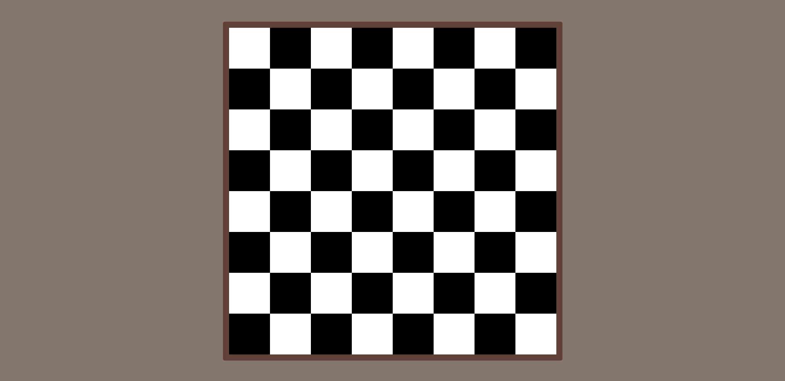

# ChessBoard
Um simples tabuleiro de xadrez, desenvolvido para treinamento pessoal no curso "Next.js & React" da Coder.

## Tecnologias utilizadas
* Html
* CSS
* JavaScript
* ReactJs

## Imagem do projeto
